# AUTO WASH PRO — ERD VÀ KẾ HOẠCH MIGRATION

> Baseline: Mini-Slice 00B Closure Patch; schema core hiện thực tại Slice 02, `lpr_attempts` tại Slice 13.
> Quy ước: InnoDB, `utf8mb4`, money dùng `DECIMAL`, timestamp theo `Asia/Ho_Chi_Minh`.

## ERD Mermaid

```mermaid
erDiagram
    TIERS {
        bigint id PK
        varchar code UK
        varchar name
        int rank_order UK
        int booking_window_days
        decimal min_monthly_spend
        int min_monthly_visits
        decimal point_rate
        boolean is_active
        datetime created_at
        datetime updated_at
    }

    USERS {
        bigint id PK
        bigint current_tier_id FK
        varchar phone UK
        varchar full_name
        varchar email
        varchar password_hash
        varchar role
        decimal monthly_spend
        int monthly_visits
        int point_balance
        varchar status
        datetime last_login_at
        datetime created_at
        datetime updated_at
    }

    VEHICLE_TYPES {
        bigint id PK
        varchar code UK
        varchar display_name
        int default_duration_minutes
        int default_capacity_units
        boolean is_active
        datetime created_at
        datetime updated_at
    }

    VEHICLES {
        bigint id PK
        bigint user_id FK
        bigint vehicle_type_id FK
        varchar normalized_plate UK
        varchar display_plate
        varchar brand
        varchar model
        text notes
        boolean is_active
        datetime created_at
        datetime updated_at
    }

    SERVICES {
        bigint id PK
        varchar code UK
        varchar name
        text description
        boolean is_active
        datetime created_at
        datetime updated_at
    }

    SERVICE_VEHICLE_PRICES {
        bigint id PK
        bigint service_id FK
        bigint vehicle_type_id FK
        decimal price
        int duration_minutes
        int capacity_units_override
        boolean is_supported
        boolean is_active
        datetime created_at
        datetime updated_at
    }

    WASH_SLOTS {
        bigint id PK
        date slot_date
        time start_time
        time end_time
        int capacity_units
        varchar status
        datetime created_at
        datetime updated_at
    }

    BOOKINGS {
        bigint id PK
        varchar booking_code UK
        bigint user_id FK
        bigint vehicle_id FK
        bigint start_slot_id FK
        bigint promotion_id FK
        varchar status
        int booking_duration_minutes
        int booking_capacity_units
        decimal subtotal
        decimal perk_discount
        decimal promotion_discount
        decimal reward_discount
        decimal final_price
        datetime completed_at
        datetime cancelled_at
        text cancellation_reason
        datetime loyalty_processed_at
        datetime created_at
        datetime updated_at
    }

    BOOKING_SLOT_RESERVATIONS {
        bigint id PK
        bigint booking_id FK
        bigint wash_slot_id FK
        int capacity_units_reserved
        datetime created_at
        datetime updated_at
    }

    BOOKING_ITEMS {
        bigint id PK
        bigint booking_id FK
        bigint service_id FK
        bigint service_vehicle_price_id FK
        varchar service_name_snapshot
        varchar vehicle_type_code_snapshot
        decimal unit_price_snapshot
        int duration_minutes_snapshot
        int capacity_units_snapshot
        int quantity
        decimal line_total
    }

    LOYALTY_TRANSACTIONS {
        bigint id PK
        bigint user_id FK
        bigint created_by FK
        varchar type "earn|adjust_credit|redeem|expire|adjust_debit"
        int points_delta
        int remaining_points
        varchar source_type
        bigint source_id
        bigint source_transaction_id FK
        text description
        datetime earned_at
        datetime expires_at
        datetime created_at
        datetime updated_at
    }

    LOYALTY_ALLOCATIONS {
        bigint id PK
        bigint debit_transaction_id FK
        bigint credit_transaction_id FK
        int allocated_points
        datetime allocated_at
    }

    REWARDS {
        bigint id PK
        varchar code UK
        bigint service_id FK
        bigint minimum_tier_id FK
        varchar name
        varchar reward_type
        int points_cost
        decimal value
        decimal max_discount
        int valid_days_after_redeem
        boolean is_active
        datetime created_at
        datetime updated_at
    }

    REWARD_VEHICLE_TYPES {
        bigint reward_id PK,FK
        bigint vehicle_type_id PK,FK
    }

    REWARD_REDEMPTIONS {
        bigint id PK
        bigint user_id FK
        bigint reward_id FK
        bigint booking_id FK
        int points_spent
        varchar status
        datetime redeemed_at
        datetime expires_at
        datetime used_at
        datetime created_at
        datetime updated_at
    }

    TIER_PERKS {
        bigint id PK
        bigint tier_id FK
        bigint service_id FK
        varchar perk_type
        decimal value
        boolean is_active
        datetime created_at
        datetime updated_at
    }

    PROMOTIONS {
        bigint id PK
        varchar code UK
        varchar name
        text description
        varchar discount_type
        decimal discount_value
        decimal max_discount
        decimal minimum_order_value
        datetime start_at
        datetime end_at
        int usage_limit
        int per_user_limit
        boolean is_active
        datetime created_at
        datetime updated_at
    }

    PROMOTION_TIERS {
        bigint promotion_id PK,FK
        bigint tier_id PK,FK
    }

    PROMOTION_SERVICES {
        bigint promotion_id PK,FK
        bigint service_id PK,FK
    }

    PROMOTION_VEHICLE_TYPES {
        bigint promotion_id PK,FK
        bigint vehicle_type_id PK,FK
    }

    PROMOTION_USAGES {
        bigint id PK
        bigint promotion_id FK
        bigint user_id FK
        bigint booking_id FK
        decimal discount_amount
        datetime used_at
    }

    MONTHLY_REVIEW_RUNS {
        bigint id PK
        char review_period UK
        varchar status
        datetime started_at
        datetime completed_at
        int processed_users
        text error_message
    }

    TIER_HISTORIES {
        bigint id PK
        bigint user_id FK
        bigint old_tier_id FK
        bigint new_tier_id FK
        char review_period
        decimal monthly_spend_snapshot
        int monthly_visits_snapshot
        text reason
        datetime created_at
    }

    RESEARCH_EVENT_LOGS {
        bigint id PK
        varchar event_key UK
        varchar anonymous_user_key
        varchar event_type
        datetime event_time
        varchar tier_code
        varchar tier_before_code
        varchar tier_after_code
        varchar vehicle_type_code
        varchar service_code
        int booking_lead_days
        decimal order_value
        decimal monthly_spend_snapshot
        int monthly_visits_snapshot
        int points_earned
        int points_redeemed
        boolean used_reward
        boolean used_promotion
        varchar cancellation_status
        varchar data_source
        json metadata_json
    }

    AUDIT_LOGS {
        bigint id PK
        bigint actor_user_id FK
        varchar action
        varchar target_type
        bigint target_id
        json before_json
        json after_json
        text reason
        datetime created_at
    }

    LPR_ATTEMPTS {
        bigint id PK
        bigint user_id FK
        varchar image_path
        varchar provider
        varchar recognized_text
        varchar normalized_text
        decimal confidence
        varchar status
        datetime created_at
        datetime updated_at
    }

    APP_SETTINGS {
        bigint id PK
        varchar setting_key UK
        varchar setting_value
        varchar value_type
        datetime created_at
        datetime updated_at
    }

    TIERS ||--o{ USERS : current_tier
    USERS ||--o{ VEHICLES : owns
    VEHICLE_TYPES ||--o{ VEHICLES : classifies
    SERVICES ||--o{ SERVICE_VEHICLE_PRICES : priced_for
    VEHICLE_TYPES ||--o{ SERVICE_VEHICLE_PRICES : has_price

    USERS ||--o{ BOOKINGS : places
    VEHICLES ||--o{ BOOKINGS : booked_vehicle
    WASH_SLOTS ||--o{ BOOKINGS : selected_start
    BOOKINGS ||--|{ BOOKING_SLOT_RESERVATIONS : holds_capacity
    WASH_SLOTS ||--o{ BOOKING_SLOT_RESERVATIONS : receives_hold
    PROMOTIONS o|--o{ BOOKINGS : selected_promotion
    BOOKINGS ||--|{ BOOKING_ITEMS : snapshots
    SERVICES ||--o{ BOOKING_ITEMS : source_service
    SERVICE_VEHICLE_PRICES ||--o{ BOOKING_ITEMS : source_price

    USERS ||--o{ LOYALTY_TRANSACTIONS : owns_ledger
    USERS o|--o{ LOYALTY_TRANSACTIONS : created_by
    LOYALTY_TRANSACTIONS ||--o{ LOYALTY_ALLOCATIONS : debit
    LOYALTY_TRANSACTIONS ||--o{ LOYALTY_ALLOCATIONS : credit_lot
    LOYALTY_TRANSACTIONS o|--o{ LOYALTY_TRANSACTIONS : correction_source

    TIERS o|--o{ REWARDS : minimum_tier
    SERVICES o|--o{ REWARDS : free_service
    REWARDS ||--o{ REWARD_VEHICLE_TYPES : restricted_to
    VEHICLE_TYPES ||--o{ REWARD_VEHICLE_TYPES : eligible_type
    USERS ||--o{ REWARD_REDEMPTIONS : redeems
    REWARDS ||--o{ REWARD_REDEMPTIONS : instances
    BOOKINGS o|--o| REWARD_REDEMPTIONS : consumes

    TIERS ||--o{ TIER_PERKS : grants
    SERVICES o|--o{ TIER_PERKS : applies_to
    PROMOTIONS ||--o{ PROMOTION_TIERS : targets_tier
    TIERS ||--o{ PROMOTION_TIERS : eligible_tier
    PROMOTIONS ||--o{ PROMOTION_SERVICES : targets_service
    SERVICES ||--o{ PROMOTION_SERVICES : eligible_service
    PROMOTIONS ||--o{ PROMOTION_VEHICLE_TYPES : targets_vehicle
    VEHICLE_TYPES ||--o{ PROMOTION_VEHICLE_TYPES : eligible_vehicle
    PROMOTIONS ||--o{ PROMOTION_USAGES : records
    USERS ||--o{ PROMOTION_USAGES : uses
    BOOKINGS ||--o| PROMOTION_USAGES : records

    USERS ||--o{ TIER_HISTORIES : reviewed
    TIERS ||--o{ TIER_HISTORIES : old_tier
    TIERS ||--o{ TIER_HISTORIES : new_tier
    USERS o|--o{ AUDIT_LOGS : acts
    USERS o|--o{ LPR_ATTEMPTS : attempts
```

## Invariant và constraint bắt buộc

| Khu vực | Constraint/invariant |
|---|---|
| Vehicle type | `vehicle_types.code` unique; không ENUM; default duration/capacity >0; referenced type không hard-delete |
| Vehicle | `normalized_plate` unique sau uppercase/bỏ space/`-`/`.`; common civilian pattern `^[0-9]{2}[A-Z]{1,2}[0-9]{4,5}$`; validator tập trung; FK owner/type; inactive thay hard-delete khi có history |
| Service price | Unique `(service_id, vehicle_type_id)`; supported ⇒ price/duration >0; override null hoặc >0 |
| Slot | Unique `(slot_date,start_time,end_time)`; capacity_units >0 |
| Booking formula | `booking_duration_minutes = SUM(item.duration_minutes_snapshot)`; `booking_capacity_units = MAX(vehicle default, item capacity snapshots)`; không cộng units; không tin client |
| Booking capacity | Unique `(booking_id,wash_slot_id)`; tổng reservation pending/confirmed không vượt từng slot; mọi slot chồng lấn được lock theo thứ tự và giữ atomically |
| Booking history | Item snapshot giữ service name, type code, price, duration, capacity; config đổi không sửa lịch sử |
| Active vehicle/time | Một vehicle không có hai booking active có khoảng thời gian chồng lấn; enforce bằng transaction và constraint/index phù hợp |
| Loyalty source | Unique idempotency theo type/source; `earn` và `adjust_credit` là credit lot; `redeem`, `expire`, `adjust_debit` là debit; adjustment correction có nullable self-FK |
| Allocation | Unique `(debit_transaction_id,credit_transaction_id)`; `allocated_points > 0`; mọi debit phân bổ đủ vào credit lot và không vượt `remaining_points` |
| Tier review | `monthly_review_runs.review_period` unique; `tier_histories(user_id,review_period)` unique |
| Reward use | Reward redemption owner-only/use-once; vehicle restriction kiểm tra backend |
| Promotion | Association composite PK; usage unique `(promotion_id,booking_id)`; limits kiểm tra có lock |
| Research | `event_key` unique cho idempotency; không FK user/PII trong export |

## Quy tắc lịch sử và xóa

- Dùng active/inactive cho vehicle type, vehicle, service, price, tier, reward, promotion.
- Không `ON DELETE CASCADE` làm mất booking snapshot, ledger/allocation, redemption, usage, tier history, research hoặc audit.
- `used_capacity_units` không lưu thành counter; tính từ `booking_slot_reservations` của booking active để tránh drift.
- Không thêm wash bay/area entity vì domain hiện tại chưa định nghĩa khu/bay; nếu phát sinh phải có requirement/decision riêng.
- Booking snapshot tổng duration và capacity lớn nhất khi tạo. Cùng mức `booking_capacity_units` được giữ trên mọi slot chồng lấn; một slot không đủ làm rollback toàn bộ booking/reservation.
- `normalized_plate` là khóa so trùng. Pattern baseline chỉ bao phủ biển dân sự Việt Nam thông dụng; biển quân đội/ngoại giao/nước ngoài/chuyên dùng/tạm/hiếm nằm ngoài phạm vi và validator không được gọi là LPR.
- Research log dùng code/metric snapshot và anonymous key; không có FK user có thể suy ngược trực tiếp.
- `late_cancelled` không phải booking status baseline; admin exception dưới 2 giờ dùng `cancelled` + reason/audit. `no_show` vẫn tồn tại.

## Loyalty FEFO và expiry

1. Lock user và credit lots còn `remaining_points > 0`; lot có expiry dùng trước theo
   `expires_at ASC, created_at ASC, id ASC`, lot không expiry dùng sau cùng theo FIFO.
2. Tạo debit transaction `redeem`, `expire` hoặc `adjust_debit`.
3. Tạo một allocation cho mỗi credit lot được dùng và giảm remaining points.
4. Tổng allocation bằng trị tuyệt đối debit; update balance trong cùng transaction.
5. Expiry dùng `expires_at = earned_at + 12 calendar months` với clamp ngày cuối tháng; expired khi `current_time >= expires_at` trong `Asia/Ho_Chi_Minh`; command `loyalty:expire-points` idempotent.

Adjustment dương tạo `adjust_credit` với `remaining_points = points_delta`, `expires_at = NULL`.
Adjustment âm tạo `adjust_debit`, lock user/credit lots, phân bổ FEFO và chỉ commit khi
`available_points + adjustment_points >= 0`; không clamp. Mỗi adjust có reason, ledger, allocation khi debit
và audit; `source_transaction_id` cho phép liên kết giao dịch được sửa.

Không có `reversal` trong baseline vì chưa có post-completion refund/reversal requirement.

## Thứ tự schema theo dependency

Slice 02 triển khai schema core bằng 6 migration nhóm theo dependency. `lpr_attempts` được bổ sung đúng Slice 13:

| # | Bảng | Phụ thuộc |
|---:|---|---|
| 001 | `app_settings` | — |
| 002 | `tiers` | — |
| 003 | `users` | tiers |
| 004 | `vehicle_types` | — |
| 005 | `vehicles` | users, vehicle_types |
| 006 | `services` | — |
| 007 | `service_vehicle_prices` | services, vehicle_types |
| 008 | `wash_slots` | — |
| 009 | `promotions` | — |
| 010 | `promotion_tiers` | promotions, tiers |
| 011 | `promotion_services` | promotions, services |
| 012 | `promotion_vehicle_types` | promotions, vehicle_types |
| 013 | `rewards` | services, tiers |
| 014 | `reward_vehicle_types` | rewards, vehicle_types |
| 015 | `tier_perks` | tiers, services |
| 016 | `bookings` | users, vehicles, wash_slots (start slot), promotions |
| 017 | `booking_slot_reservations` | bookings, wash_slots |
| 018 | `booking_items` | bookings, services, service_vehicle_prices |
| 019 | `reward_redemptions` | users, rewards, bookings |
| 020 | `promotion_usages` | promotions, users, bookings |
| 021 | `loyalty_transactions` | users; self-FK `source_transaction_id` nullable |
| 022 | `loyalty_allocations` | loyalty_transactions |
| 023 | `monthly_review_runs` | — |
| 024 | `tier_histories` | users, tiers |
| 025 | `research_event_logs` | — |
| 026 | `audit_logs` | users |
| 027 | `lpr_attempts` | users; chỉ tạo khi Slice 13 được triển khai |

Migration runner/history thuộc Slice 02 và không phải entity nghiệp vụ.

Slice 12 thêm migration `008_add_reward_percentage_cap`, bổ sung `rewards.max_discount` nullable để hiện
thực acceptance RWD-03 đã có trong đặc tả. Migration không tạo entity hoặc quan hệ mới.

Slice 13 thêm migration `009_create_lpr_attempts`, hiện thực entity đã duyệt với provider, kết quả nhận diện,
confidence, status, owner nullable và đường dẫn ảnh ngoài public; không thay đổi quan hệ nghiệp vụ khác.
